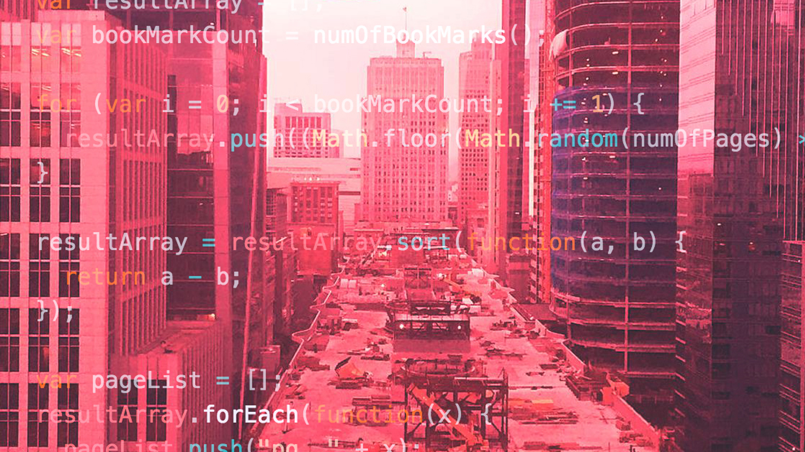

### Coding Bootcamp Prep

This is a collection of practice material I wish I had when preparing
for the technical interview application process at immersive coding
bootcamps.

I plan to use this repository as a supplement to a video course which
will be for sale on Udemy.com

## Creation Story

For most of 2016, I've been working hard to learn the needed
coding skills to pass technical interviews. My goal was to get
accepted to the top programming bootcamps in San Francisco.

In July of 2016, I applied to MakerSquare, Hack Reactor and App Academy.

I was accepted into Hack Reactor and App Academy, both of which
are considered very challenging schools to get into.

After a lot of deliberation I chose to be a part of the November, 2016
cohort at App Academy.

At the time of writing this, I have 2 months until the start of the
cohort so I want to spend the time teaching others how I think about
the technical challenges and provide material to speed the skill
acquisition of future aspiring programmers.

## Tools

There are a lot of tools to get hung up on. We're not going to do that.

In this course we will use Node and a simple text editor. Both are easy
installs.

Programmers are crazy about their tools and that is a good thing. We're
learning the basics so we don't need the fancy stuff. Fancy tools will
actually hurt you during your coding interview because they become a crutch.
During many interviews, you won't be able to run your code or write in
an editor that gives you hints on syntax. We're doing this spartan style
so you have the core ability to pass the technical interview no matter
what tools they ask you to program in.

## Language

We will be using JavaScript. Here's why:

JavaScript is used to build almost all websites these days.

Even if you're going to a school that focuses on Ruby or Python,
you will still find yourself using JavaScript (or it's derivatives)
to display the results of your code on a website.

For that reason, it makes sense to learn JavaScript first. The
syntax is more challenging (IMHO) and therefore it is better to
start there. Once you get good at JavaScript, Ruby and Python
are easy to pick up. I transitioned from Ruby to JavaScript and
I think it would have been easier to go the other way.

When I started, I learned Ruby. After transitioning to JavaScript,
I wish I had started there and moved to Ruby later.

I hope you find this useful.
